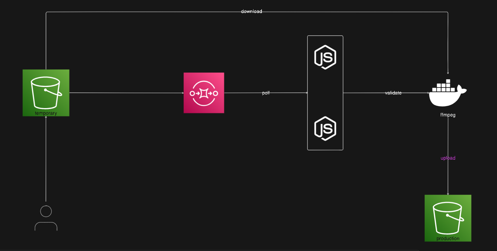

# Video Transcoder

## Description

**Video Transcoder** is a highly scalable video transcoding pipeline that utilizes AWS services such as ECS, SQS, and S3 for efficient video processing and storage. This project is designed to handle video transcoding tasks at scale, ensuring seamless and reliable video processing.

## Prerequisites

Before you begin, ensure you have the following installed and set up:

- Node.js
- Docker
- An AWS account with appropriate permissions for ECS, SQS, and S3

## Installation

Follow these steps to set up the project:

1. Clone the repository:
    ```sh
    git clone https://github.com/phiineas/video-transcoder.git
    cd video-transcoder
    ```

2. Install the project dependencies:
    ```sh
    npm install
    ```

3. Install dependencies for the Docker container:
    ```sh
    cd container
    npm install
    cd ..
    ```

## Usage

### Development

To start the development server, use:
```sh
npm run dev
```

### Docker

To build and run the Docker container:

1. Build the Docker image:
    ```sh
    docker build -t video-transcoder .
    ```
    
2. Run the Docker container:
    ```sh
    docker run -e BUCKET_NAME=your-bucket-name -e KEY=your-key -p 3000:3000 video-transcoder
    ```

Environment Variables
- BUCKET_NAME: The name of the S3 bucket where videos are stored.
- KEY: The key (path) of the video file in the S3 bucket.

## System Design

This diagram illustrates the architecture and flow of the Video Transcoder pipeline, showcasing how AWS services are integrated to process and store video files.

